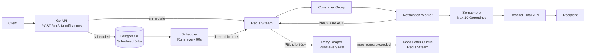
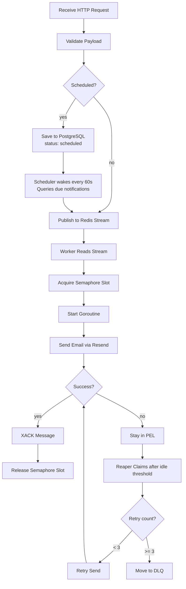

# Intunel

A queue-driven notification service built with Go and Redis Streams.

The service accepts notification requests through an HTTP API, publishes them to a Redis Stream, and processes them asynchronously using Redis Consumer Groups. Each notification is handled concurrently in its own goroutine while a semaphore limits concurrency to prevent resource exhaustion. Email delivery is currently powered by Resend.

## Architecture



The runtime flow is:

1. A client sends a notification request to the API.
2. The API validates the request.
3. If the notification is immediate, it is published to a Redis Stream.
4. If the notification is scheduled, it is saved to PostgreSQL with a UTC timestamp.
5. A separate worker service continuously reads new messages using a Redis Consumer Group.
6. Each message is processed in its own goroutine.
7. A semaphore limits the number of concurrently running goroutines to 10.
8. The notification is sent through the Resend Email API.
9. Once processing succeeds, the message is acknowledged (`XACK`) to remove it from the Pending Entries List.
10. A Scheduler goroutine wakes every 60 seconds, queries PostgreSQL for due notifications, publishes them to the Redis Stream, and marks them as queued.

---

## Components

### API Service

Responsible for accepting notification requests.

Endpoints:

* `POST /api/v1/notifications`

  * validates incoming requests
  * publishes the notification to a Redis Stream
* `GET /healthz`

  * returns service health

---

### Worker Service

Runs independently from the API.

Responsibilities:

* Reads messages from Redis Streams using Consumer Groups.
* Processes notifications concurrently.
* Uses a semaphore to limit concurrency to 10 goroutines.
* Sends emails through Resend.
* Acknowledges successfully processed messages.

### Retry Reaper

Runs as a background goroutine inside the worker service.

Responsibilities:

* Wakes up every 60 seconds and scans the Pending Entries List (PEL).
* Claims messages that have been idle beyond their retry threshold.
* Applies exponential-style backoff between retries:
  * Retry 1 — after 1 minute idle
  * Retry 2 — after 5 minutes idle
  * Retry 3 — move to Dead Letter Queue
* Tracks retry count per message in a Redis Hash (`notifications:retry:<msgID>`).
* Deletes the hash key on success or after DLQ handoff.

---

### Scheduler

Runs as a background goroutine inside the worker service alongside the consumer and reaper.

Responsibilities:

* Wakes up every 60 seconds.
* Queries PostgreSQL for notifications where `status = scheduled` and `scheduled_at <= now (UTC)`.
* Publishes each due notification to the Redis Stream.
* Marks each published notification as `queued` with a `published_at` timestamp.

Scheduled notifications are stored in PostgreSQL rather than Redis to ensure durability across restarts. Once published to the stream they follow the same processing pipeline as immediate notifications including retry and DLQ support.

---

### PostgreSQL

Used exclusively for scheduled notification storage.

Each scheduled notification stores:

* `channel` — delivery channel (email, sms, push)
* `to_address` — recipient
* `title` — notification title
* `body` — notification body
* `scheduled_at` — UTC timestamp of when to send
* `status` — `scheduled` → `queued`
* `published_at` — when the scheduler published it to the stream

---

### Dead Letter Queue (DLQ)

A separate Redis Stream (`notifications:stream:dead`) that holds messages which have exhausted all retry attempts.

Each DLQ entry stores:

* `data` — original notification payload
* `error` — exact error from the last failed attempt
* `failed_at` — unix timestamp of final failure
* `msg_id` — original stream message ID for traceability

---

### Redis Streams

Redis Streams act as the message broker between the API and worker.

Benefits:

* Durable message queue
* Consumer Groups for horizontal scaling
* Pending Entries List for reliability
* Message acknowledgements (`XACK`)
* Failed message recovery (`XCLAIM`/`XAUTOCLAIM` support)

---

### Email Provider

Current provider:

* Resend

The email layer is isolated behind an interface, making it easy to replace or add providers in the future.

---

## Architecture Decisions

### Asynchronous Processing

Instead of sending emails directly from the API, requests are queued in Redis Streams.

Benefits:

* Faster API responses
* Better fault tolerance
* Retry capability
* Horizontal scalability

### Consumer Groups

Consumer Groups ensure that:

* each notification is processed only once
* multiple worker instances can share the workload
* failed messages remain recoverable

### Controlled Concurrency

Although each notification is processed in a separate goroutine, a semaphore limits concurrent processing to **10** workers.

This prevents:

* excessive memory usage
* API rate-limit spikes
* overwhelming the email provider
* uncontrolled goroutine growth

### Retry Mechanism with Backoff

Failed messages are not dropped or retried immediately. Instead they remain in the Redis Pending Entries List (PEL) and a separate Reaper process claims them after an idle threshold.

Backoff windows:
* Retry 1 — 1 minute
* Retry 2 — 5 minutes
* Retry 3 — Dead Letter Queue

Retry state is stored in a Redis Hash per message with a 24 hour TTL as a safety net against orphaned keys.

### Dead Letter Queue

Messages that fail all 3 retry attempts are moved to a dedicated DLQ stream with the original payload and exact error reason preserved. This allows for future inspection, alerting, or manual replay without losing the message.

### Scheduled Notifications

Scheduled notifications are stored in PostgreSQL rather than queued directly in Redis. This ensures they survive worker restarts, Redis flushes, or any infrastructure failure before their send time.

The client sends a human-readable date, time, and IANA timezone name (e.g. `Africa/Lagos`, `Europe/London`, `America/New_York`). The API converts this to UTC before saving, so the scheduler always operates in UTC regardless of the sender's location or season. DST changes are handled automatically by Go's timezone database.

Once the scheduled time is reached the notification enters the standard stream pipeline and benefits from the same retry and DLQ guarantees as immediate notifications.

---

## Running Locally

### Using Docker

```bash
docker compose up --build
```

This starts:

* Redis
* API Service
* Notification Worker

The API will be available at:

```
http://localhost:8080
```

---

### Without Docker

Start Redis.

Run the API:

```bash
go run ./cmd/api
```

Run the worker:

```bash
go run ./cmd/worker
```

---

## Example Request

```http
POST /api/v1/notifications
Content-Type: application/json
```

```json
{
  "channel": "email",
  "to": "john@example.com",
  "title": "Welcome",
  "body": "<h1>Welcome to our platform!</h1>"
}
```

---

## Scheduled Notification Request

```http
POST /api/v1/notifications
Content-Type: application/json
```

```json
{
  "channel": "email",
  "to": "john@example.com",
  "title": "Trial ending soon",
  "body": "<h1>Your trial ends tomorrow</h1>",
  "date": "2026-07-21",
  "time": "09:00:00",
  "timezone": "Africa/Lagos"
}
```

The API converts the local time to UTC using the provided IANA timezone, saves it to PostgreSQL, and returns `202 Accepted`. The scheduler publishes it to the stream when the time is reached.

---

## Processing Pipeline



---

## Technologies

* Go
* Redis Streams
* Redis Consumer Groups
* Redis Hash (retry state)
* Dead Letter Queue pattern
* PostgreSQL (scheduled notification storage)
* GORM
* Goroutines
* Channels
* Semaphore Pattern
* Resend Email API
* Docker

---

## Future Improvements

* Email templates
* Metrics and monitoring
* Distributed tracing
* Rate limiting
* Retry dashboards
* Provider failover

---

## Notes

* The API is intentionally lightweight and only publishes messages to Redis.
* Email sending is fully asynchronous.
* Consumer Groups enable multiple worker instances for horizontal scaling.
* Goroutine concurrency is intentionally capped at 10 using a semaphore to maintain stable resource usage.
* Additional notification channels can be added without changing the API by extending the worker layer.
* Scheduled notifications are stored in PostgreSQL for durability and converted to UTC at request time using IANA timezone names.
* The Scheduler, Consumer, and Reaper all run as goroutines within the same worker binary sharing a single Redis and PostgreSQL connection pool.

