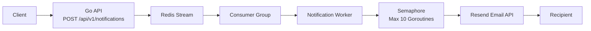
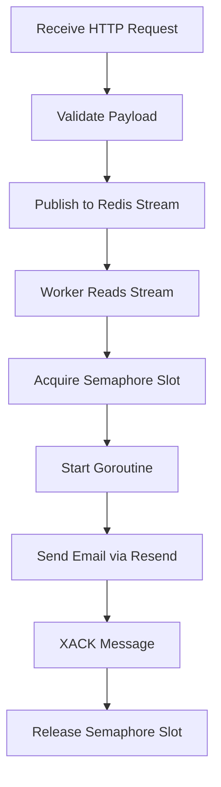

# Intunel

A queue-driven notification service built with Go and Redis Streams.

The service accepts notification requests through an HTTP API, publishes them to a Redis Stream, and processes them asynchronously using Redis Consumer Groups. Each notification is handled concurrently in its own goroutine while a semaphore limits concurrency to prevent resource exhaustion. Email delivery is currently powered by Resend.

## Architecture



The runtime flow is:

1. A client sends a notification request to the API.
2. The API validates the request.
3. The notification is published to a Redis Stream.
4. A separate worker service continuously reads new messages using a Redis Consumer Group.
5. Each message is processed in its own goroutine.
6. A semaphore limits the number of concurrently running goroutines to 10.
7. The notification is sent through the Resend Email API.
8. Once processing succeeds, the message is acknowledged (`XACK`) to remove it from the Pending Entries List.

---

## Components

### API Service

Responsible for accepting notification requests.

Endpoints:

* `POST /api/v1/notifications`

  * validates incoming requests
  * publishes the notification to a Redis Stream
* `GET /healthz`

  * returns service health

---

### Worker Service

Runs independently from the API.

Responsibilities:

* Reads messages from Redis Streams using Consumer Groups.
* Processes notifications concurrently.
* Uses a semaphore to limit concurrency to 10 goroutines.
* Sends emails through Resend.
* Acknowledges successfully processed messages.

---

### Redis Streams

Redis Streams act as the message broker between the API and worker.

Benefits:

* Durable message queue
* Consumer Groups for horizontal scaling
* Pending Entries List for reliability
* Message acknowledgements (`XACK`)
* Failed message recovery (`XCLAIM`/`XAUTOCLAIM` support)

---

### Email Provider

Current provider:

* Resend

The email layer is isolated behind an interface, making it easy to replace or add providers in the future.

---

## Architecture Decisions

### Asynchronous Processing

Instead of sending emails directly from the API, requests are queued in Redis Streams.

Benefits:

* Faster API responses
* Better fault tolerance
* Retry capability
* Horizontal scalability

### Consumer Groups

Consumer Groups ensure that:

* each notification is processed only once
* multiple worker instances can share the workload
* failed messages remain recoverable

### Controlled Concurrency

Although each notification is processed in a separate goroutine, a semaphore limits concurrent processing to **10** workers.

This prevents:

* excessive memory usage
* API rate-limit spikes
* overwhelming the email provider
* uncontrolled goroutine growth

---

## Running Locally

### Using Docker

```bash
docker compose up --build
```

This starts:

* Redis
* API Service
* Notification Worker

The API will be available at:

```
http://localhost:8080
```

---

### Without Docker

Start Redis.

Run the API:

```bash
go run ./cmd/api
```

Run the worker:

```bash
go run ./cmd/worker
```

---

## Example Request

```http
POST /api/v1/notifications
Content-Type: application/json
```

```json
{
  "channel": "email",
  "to": "john@example.com",
  "title": "Welcome",
  "body": "<h1>Welcome to our platform!</h1>"
}
```

---

## Processing Pipeline



---

## Technologies

* Go
* Redis Streams
* Redis Consumer Groups
* Goroutines
* Channels
* Semaphore Pattern
* Resend Email API
* Docker

---

## Future Improvements

* Retry mechanism with exponential backoff
* Dead Letter Queue (DLQ)
* Scheduled notifications
* Email templates
* Metrics and monitoring
* Distributed tracing
* Rate limiting
* Retry dashboards
* Provider failover

---

## Notes

* The API is intentionally lightweight and only publishes messages to Redis.
* Email sending is fully asynchronous.
* Consumer Groups enable multiple worker instances for horizontal scaling.
* Goroutine concurrency is intentionally capped at 10 using a semaphore to maintain stable resource usage.
* Additional notification channels can be added without changing the API by extending the worker layer.
